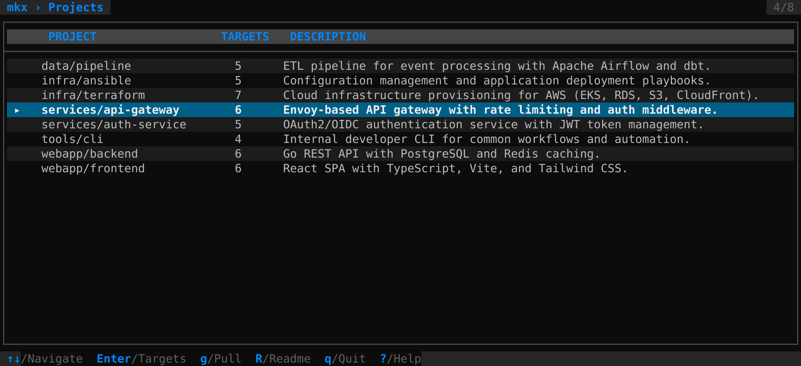
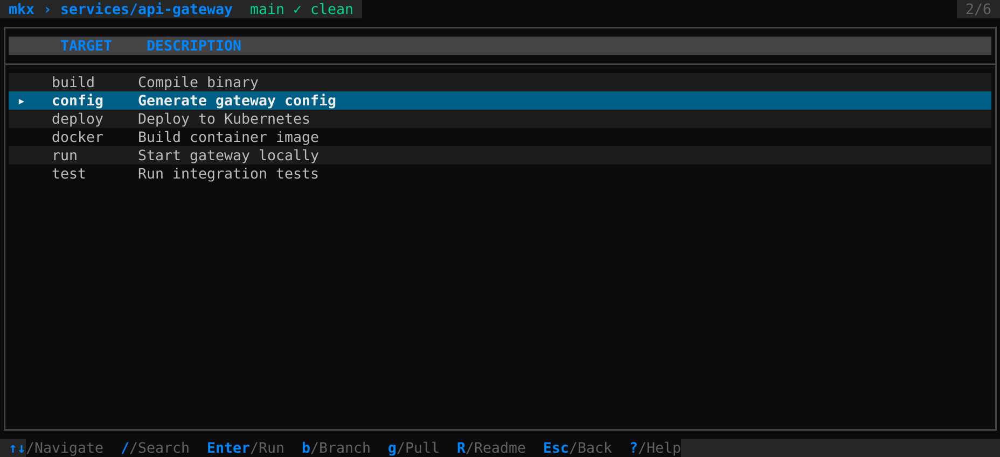

# mkx

[](https://github.com/Gaetan-Jaminon/mkx/actions/workflows/ci.yml)
[](https://github.com/Gaetan-Jaminon/mkx/releases/latest)
[](https://go.dev/)
[](LICENSE)

Make target runner TUI with k9s-style navigation.

Discover projects in a workspace, browse their Make targets, and run them with full terminal handover.





## Features

- Recursive Makefile discovery with configurable depth and exclusions
- Project list / target list navigation (j/k, Enter, Esc)
- Target descriptions from `## comment` convention
- Full terminal handover — interactive prompts work natively
- Git pull and refresh targets with `g` key
- README viewer with rendered markdown via `R` key
- Context-sensitive help overlay via `?` key
- Status bar with exit code and duration

## Install

```bash
go install github.com/Gaetan-Jaminon/mkx@latest
```

Or build from source:

```bash
git clone https://github.com/Gaetan-Jaminon/mkx.git
cd mkx
go build -o mkx .
```

## Usage

```bash
cd ~/workspace
mkx
```

## Key Bindings

| Key | Project List | Target List |
|-----|-------------|-------------|
| j/k, arrows | Navigate | Navigate |
| Enter | Drill into project | Run target |
| g | Git pull & refresh | Git pull & refresh |
| R | View README | View README |
| ? | Help overlay | Help overlay |
| Esc | - | Back |
| q | Quit | Quit |

`?` opens a help overlay listing the keys available in the current view. The
README viewer moved to `R` to free it.

`r` is not bound. Across Taelron TUIs `r` means *refresh*, and mkx's target
lists are parsed once at startup, so there is nothing to refresh. It used to
run the selected target — press `Enter` instead.

## Development

### The golden oracle

`testdata/fixtures.golden` records what mkx discovers over `testdata/fixtures/` — which projects, which targets, which descriptions. `TestCharacterization` compares a live run against it, so any unintended change to discovery behaviour shows up as a failing test. Run it on its own with `make verify`.

The golden is **never written by the test suite**. A missing, empty, or malformed golden fails; it is not regenerated. A test that rewrites its own oracle when it fails is checking nothing.

**Re-anchoring the golden** is a separate, deliberate command:

```bash
make rebaseline-golden
```

It prints every line it added and removed, so an unintended rebaseline is visible in the terminal as it happens rather than only later in a diff.

Regenerating is **legitimate** when discovery behaviour changed on purpose and the change has been reviewed — extending the target metadata mkx retains, for instance, which moves every target line in the golden. Rebaseline, read the printed diff line by line, confirm each change is one you meant, and commit the golden in the same PR as the behaviour change that caused it.

Regenerating is **not legitimate** as a way to make a red test green. A diff you did not expect means the code changed behaviour, not that the golden is stale.

### The liveness guard

`TestCharacterizationIsRegistered` fails if the oracle stops existing — deleted, renamed, skipped, or excluded by a build constraint. Without it, removing the characterization test would simply make `go test ./...` run less and stay green, and nothing would report that the only check on behaviour equivalence had gone.

It reads the package source statically, so it does not depend on the characterization test running. It lives in its own file for the same reason: deleting `characterization_test.go` leaves the guard behind to complain. Deleting both defeats it — that is its acknowledged limit, and the reason it is worth noticing in review.

Prove both mechanisms actually fail, rather than trusting that they would:

```bash
make verify-guards
```

It sabotages throwaway copies of the repository six ways and asserts each one goes red. Your working tree is not touched.

## Stack

- [Go](https://go.dev)
- [Bubble Tea](https://github.com/charmbracelet/bubbletea)
- [Lip Gloss](https://github.com/charmbracelet/lipgloss)
